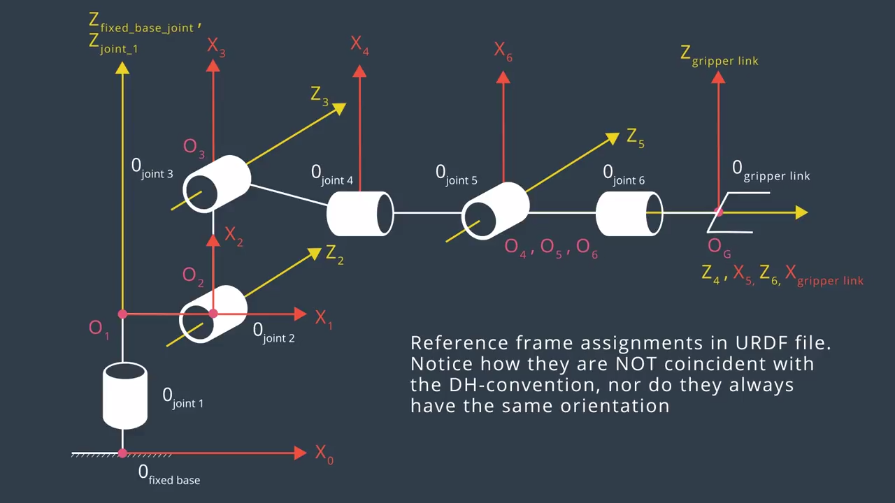
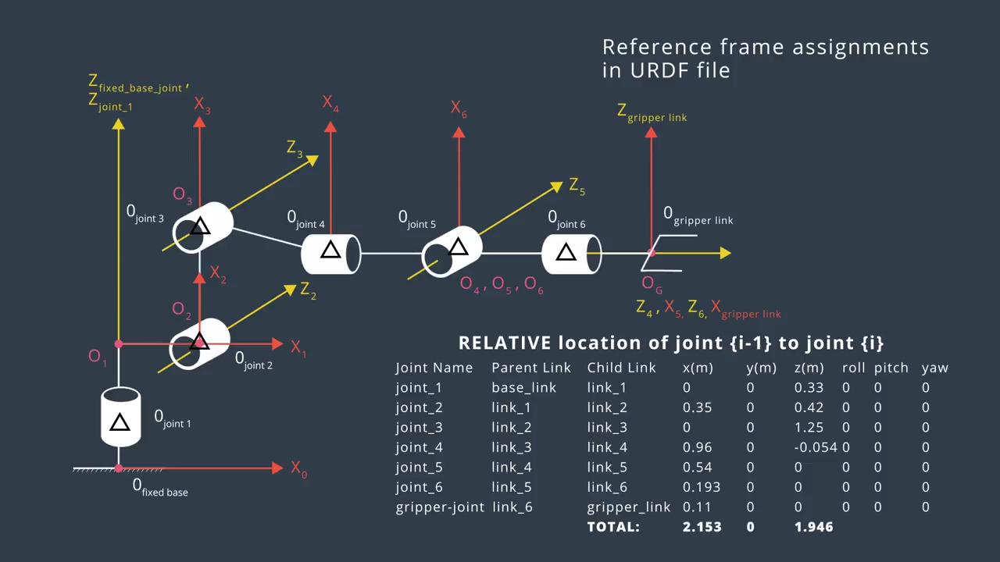
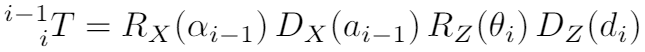
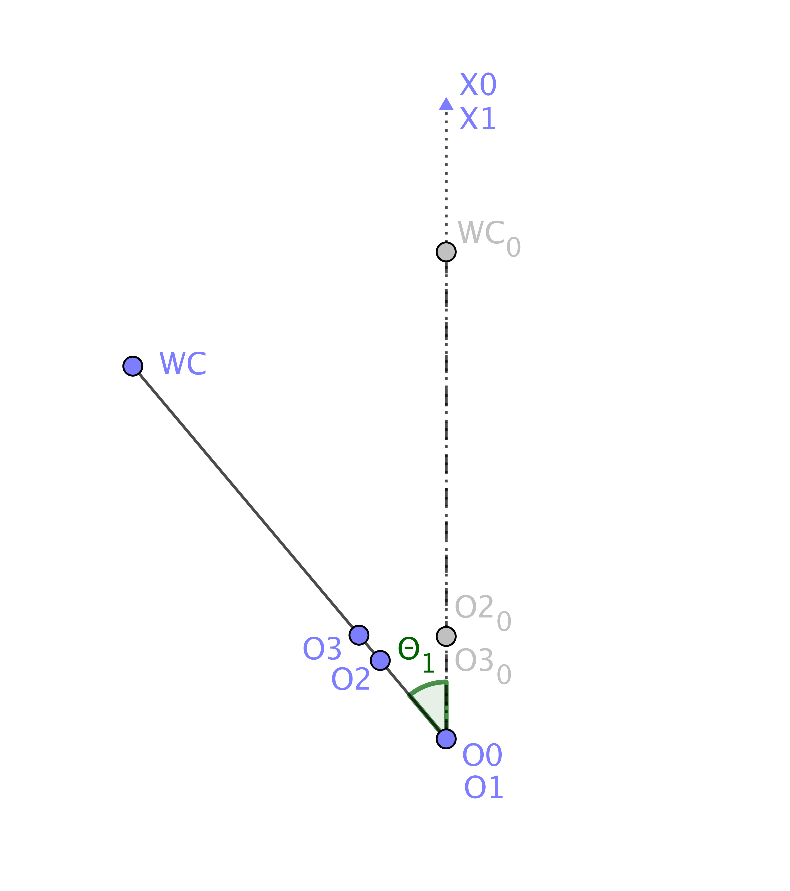
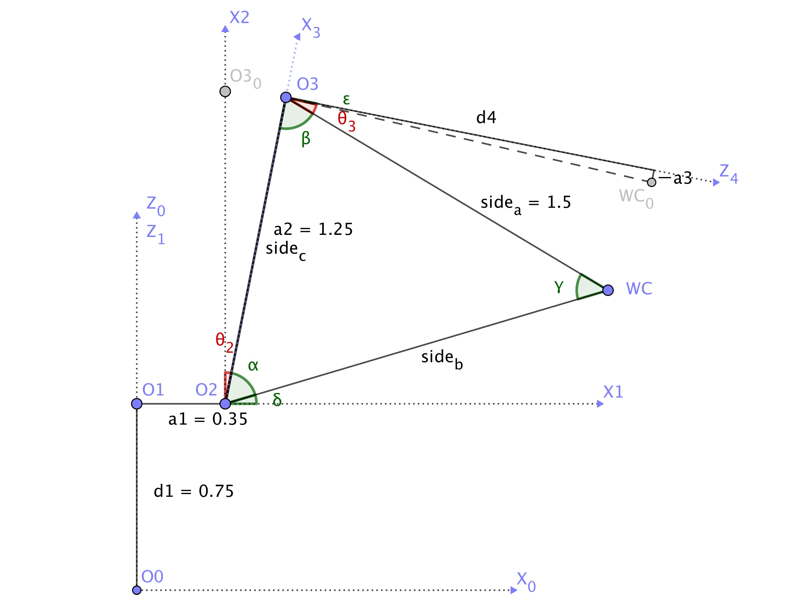

## Project: Kinematics Pick & Place
### Writeup Template: You can use this file as a template for your writeup if you want to submit it as a markdown file, but feel free to use some other method and submit a pdf if you prefer.

---


**Steps to complete the project:**  


1. Set up your ROS Workspace.
2. Download or clone the [project repository](https://github.com/udacity/RoboND-Kinematics-Project) into the ***src*** directory of your ROS Workspace.  
3. Experiment with the forward_kinematics environment and get familiar with the robot.
4. Launch in [demo mode](https://classroom.udacity.com/nanodegrees/nd209/parts/7b2fd2d7-e181-401e-977a-6158c77bf816/modules/8855de3f-2897-46c3-a805-628b5ecf045b/lessons/91d017b1-4493-4522-ad52-04a74a01094c/concepts/ae64bb91-e8c4-44c9-adbe-798e8f688193).
5. Perform Kinematic Analysis for the robot following the [project rubric](https://review.udacity.com/#!/rubrics/972/view).
6. Fill in the `IK_server.py` with your Inverse Kinematics code. 

## [Rubric](https://review.udacity.com/#!/rubrics/972/view) Points
### Here I will consider the rubric points individually and describe how I addressed each point in my implementation.  

---
### Writeup / README

#### 1. Provide a Writeup / README that includes all the rubric points and how you addressed each one.  You can submit your writeup as markdown or pdf.  

You're reading it!

### Kinematic Analysis
#### 1. Run the forward_kinematics demo and evaluate the kr210.urdf.xacro file to perform kinematic analysis of Kuka KR210 robot and derive its DH parameters.

Link frames assigned in Kuka KR210 are shown in the image below.



The image below shows the position offset of each joint expressed in the kr210.urdf.xacro file.



From the above conditions, DH parameters for Kuka KR210 are derived as follows.

Link     | alpha(i-1)  | a(i-1)  | d(i)  | theta(i)
---      | ---         | ---     | ---   | ---
0->1     | 0           | 0       | 0.75  | q1
1->2     | - pi/2      | 0.35    | 0     | -pi/2 + q2
2->3     | 0           | 1.25    | 0     | q3
3->4     | - pi/2      | -0.054  | 1.5   | q4
4->5     | pi/2        | 0       | 0     | q5
5->6     | - pi/2      | 0       | 0     | q6
6->7(EE) | 0           | 0       | 0.303 | 0

- alpha(i-1) : Twist angle, ange between Z(i-1) and Z(i) measured about X(i-1) in a right hand sense.
- a(i-1) : Link length, distance from Z(i-1) to Z(i), measured along X(i-1).
- d(i) : Link offset, distance from X(i-1) to X(i) measured along Z(i).
- theta(i) : Joint angle, angle between X(i-1) and X(i) measured about Z(i) in a right hand sense.
- q(i) : Variable for the angle of joint(i)

#### 2. Using the DH parameter table you derived earlier, create individual transformation matrices about each joint. In addition, also generate a generalized homogeneous transform between base_link and gripper_link using only end-effector(gripper) pose.

The homogeneous transform from frame(i-1) to frame(i) is constructed as follows.




- Rx/Rz : Rotation about X/Z axis
- Dx/Dz : Transformation along X/Z axis
- c : cosine
- s : sine

Individual transformation matrix for each frame calculated using the above equation and the DH parameters is shown below.

```
T0_1 = Matrix([
	[cos(q1), -sin(q1), 0, 0],
	[sin(q1), cos(q1), 0, 0],
	[0, 0, 1, 0.75],
	[0, 0, 0, 1]])

T1_2 = Matrix([
	[sin(q2), cos(q2), 0, 0.35],
	[0, 0, 1, 0],
	[cos(q2), -sin(q2), 0, 0],
	[0, 0, 0, 1]])

T2_3 = Matrix([
	[cos(q3), -sin(q3), 0, 1.25],
	[sin(q3), cos(q3), 0, 0],
	[0, 0, 1, 0],
	[0, 0, 0, 1]])

T3_4 = Matrix([
	[cos(q4), -sin(q4), 0, -0.054],
	[0, 0, 1, 1.5],
	[-sin(q4), -cos(q4), 0, 0],
	[0, 0, 0, 1]])

T4_5 = Matrix([
	[cos(q5), -sin(q5), 0, 0],
	[0, 0, -1, 0],
	[sin(q5), cos(q5), 0, 0],
	[0, 0, 0, 1]])

T5_6 = Matrix([
	[cos(q6), -sin(q6), 0, 0],
	[0, 0, 1, 0],
	[-sin(q6), -cos(q6), 0, 0],
	[0, 0, 0, 1]])

T6_E = Matrix([
	[1, 0, 0, 0],
	[0, 1, 0, 0],
	[0, 0, 1, 0.303],
	[0, 0, 0, 1]])
```

Generalized homogeneous transform between baselink and gripperlink using only end-effector(gripper) pose is calculated as below.

```
Matrix([
	[cos(p)*cos(y), sin(p)*sin(r)*cos(y) - sin(y)*cos(r), sin(p)*cos(r)*cos(y) + sin(r)*sin(y), x],
	[sin(y)*cos(p), sin(p)*sin(r)*sin(y) + cos(r)*cos(y), sin(p)*sin(y)*cos(r) - sin(r)*cos(y), y],
	[-sin(p), sin(r)*cos(p), cos(p)*cos(r), z],
	[0, 0, 0, 1]])
```

#### 3. Decouple Inverse Kinematics problem into Inverse Position Kinematics and inverse Orientation Kinematics; doing so derive the equations to calculate all individual joint angles.

Because joint 4,5,6 intersect at a single point, these joint angles are solvable analitically.

Joint 4,5,6 is a design of Spherical Wrist with joint_5 being the common intersection (Wrist Center, WC).

This design kinematiccally decouples the position and orientation of the End Effector (EE), which makes it possible to independently solve two simpler problems.
First, solve the position of the WC (Inverse Position Kinematics), and next we solve the composition of rotations that orient the EE (Inverse Orientation Kinematics).

First, we calculate the position of the WC using the EE  pose and position:

```
p0W_0 = p0E_0 - d7 * rot0_E[:,2]
```

- p0W_0 : Location of the WC relative to the base frame
- p0E_0 : Location of the EE  relative to the base frame
- d7 : Link length from the WC to the EE (= 0.303)
- rot0_E : Rotation of the EE relative to the base frame

Next we calulate theta 1, 2 and 3.

We can calculate theta 1 with the x and y position of the WC.

```
theta1 = atan2(p0W_0[1], p0W_0[0])
```



The diagram below shows how theta 2 and theta 3 are  calculated.



From the diagram above, theta 2 and theta 3 can be calculated with the following formula.

```
theta2 = pi/2 - alpha - delta
theta3 = pi/2 - beta - epsilon
```

Where alpha, beta, delta and epsilon are calculated with the following formula.

```
alpha = acos((side_b**2 + side_c**2 - side_a**2) / (2 * side_b * side_c))
beta = acos((side_a**2 + side_c**2 - side_b**2) / (2 * side_a * side_c))

delta = atan2(p0W_0[2] - d1, sqrt(p0W_0[0]**2 + p0W_0[1]**2) - a1)
epsilon = atan2(- a3, d4)
```

Calculating alpha and beta uses the [Law of cosines](https://en.wikipedia.org/wiki/Law_of_cosines).

Finally, we solve the joint 4, 5, and 6.

Using the EE pose and the theta1/2/3 calculated above, we can calculate the rotation between frame 3 and frame 6 as below.

```
R3_6 = inv(R0_3) * R0_6
```
- R0_3 : Rotation matrix calculated using theta 1/2/3
- R0_6 : EE pose (Rotation between base frame and EE)

The left hand side of the above above equation is  the rotatinal part of the composition of homogenous transform T3_4, T4_5, T5_6:

```
R3_6 = (T3_4 * T4_5 * T5_6)[:3,:3]
R3_6 = Matrix([
	[-sin(q4)*sin(q6) + cos(q4)*cos(q5)*cos(q6), -sin(q4)*cos(q6) - sin(q6)*cos(q4)*cos(q5), -sin(q5)*cos(q4)],
	[sin(q5)*cos(q6), -sin(q5)*sin(q6), cos(q5)],
	[-sin(q4)*cos(q5)*cos(q6) - sin(q6)*cos(q4), sin(q4)*sin(q6)*cos(q5) - cos(q4)*cos(q6), sin(q4)*sin(q5)]])
```
Wich gives us the equation to calculate the joint angles 4, 5 and 6.

```
theta4 = atan2(rot3_6[2, 2], -rot3_6[0, 2])
theta5 = atan2(sqrt(rot3_6[0, 2]**2 + rot3_6[2, 2]**2), rot3_6[1, 2])
theta6 = atan2(-rot3_6[1, 1], rot3_6[1, 0])
```

### Project Implementation

#### 1. Fill in the `IK_server.py` file with properly commented python code for calculating Inverse Kinematics based on previously performed Kinematic Analysis. Your code must guide the robot to successfully complete 8/10 pick and place cycles. Briefly discuss the code you implemented and your results. 

##### Implimentation

Inverse Kinematics 
In the `IK_server.py` file, I implemented Inverse Kinematics as explained in the paragraph above. I also implemented the Forward Kinematics to calculate the EE position error.

Also, I did all the possible initializations in the `initialize_global_variables()` function to speed up the process.

##### Improvement

Here are some improvements I might make if I were going to pursue this project further:

- Joint 4 and 6 often rotates unnecessarily
  - This causes the robot arm move quite slow
  - Maybe I can reduce the unnecessary movements by correcting the angle of joint 4 and 6
- Sometimes the robot arm aproaches from the side to the object
  - In this situation, the arm pushes away the object from it and fails to pick.
  - I think this is caused by the motion planning, not by the Inverse Kinematics.
  - I should check the motion planning code to figure out why this problem happens.

## 